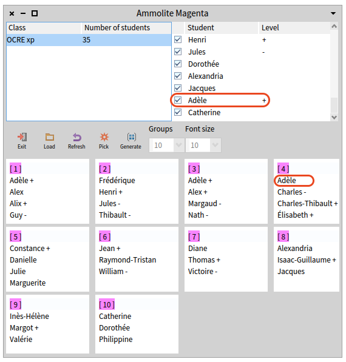
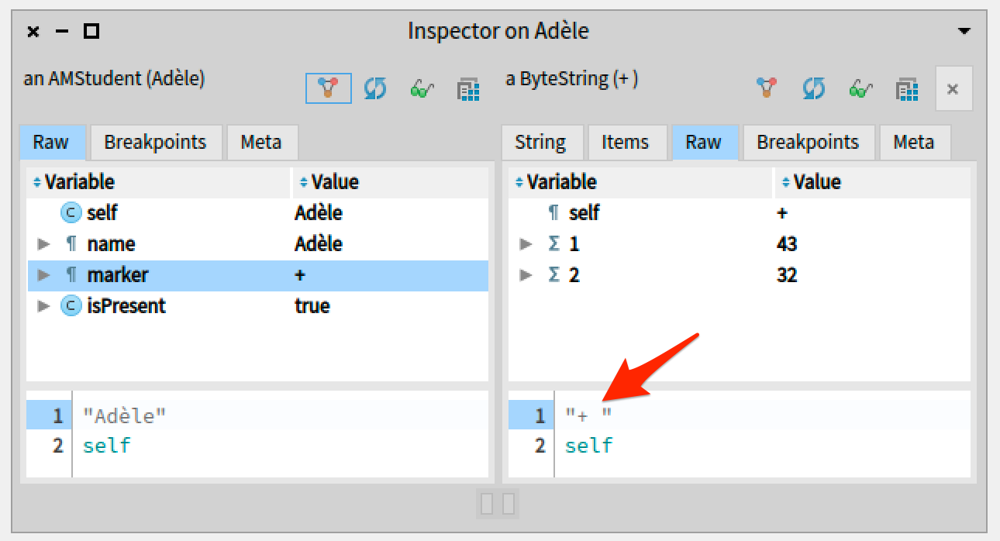
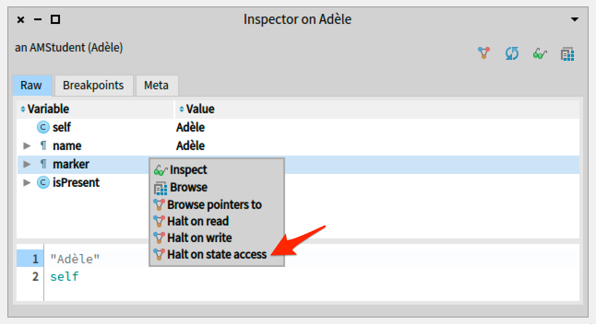
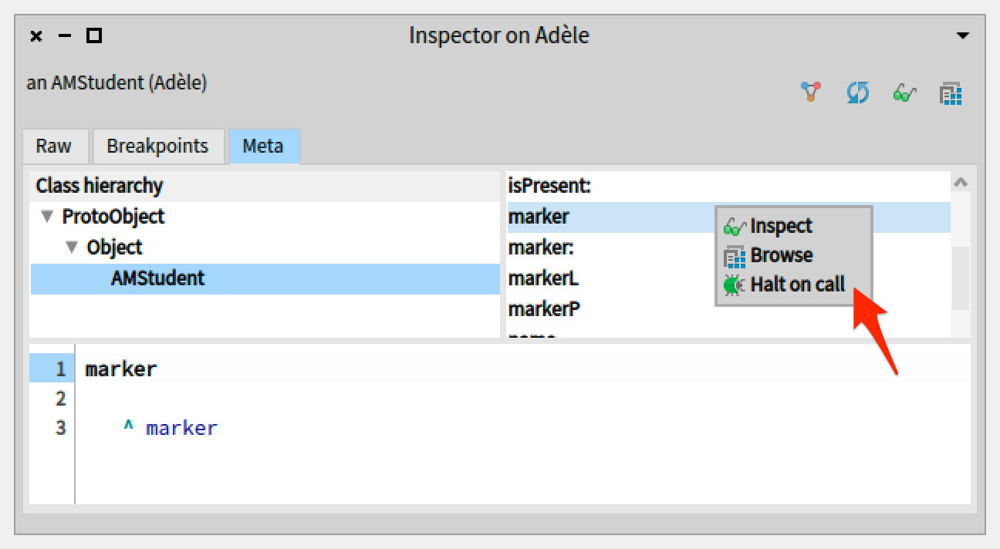
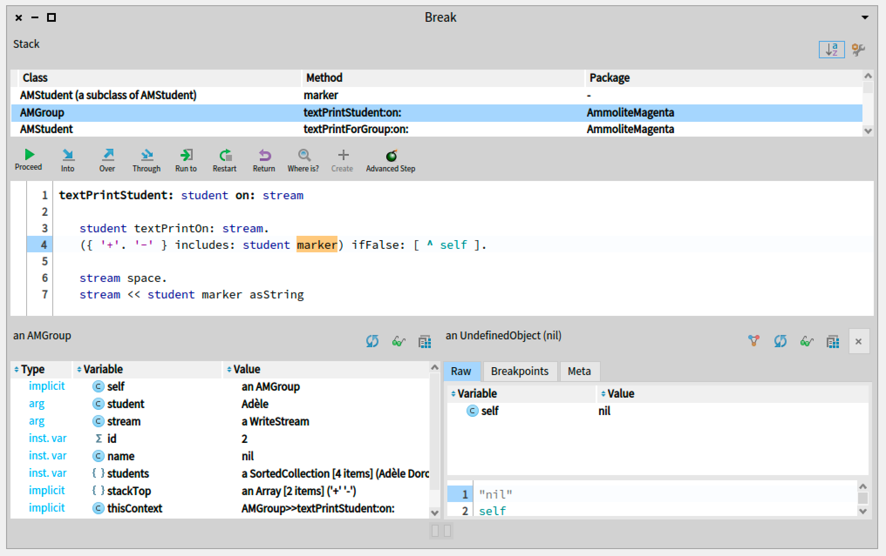

# A method to track the root cause of the Ammolite bug, using object-centric breakpoints

The description of the Ammolite bug can be found here: [../Description/Ammolite.md](../Description/Ammolite.md)

## Bug characteristics

The bug has the following characteristics:
- It is a real bug of Ammolite which itself is a real application (used by teachers to create well-balanced groups of students),
- although not the same scenario, it conforms to Ressia'12 example `Live Object Interaction` where an object is incorrectly displayed on the application (here, with a missing marker).
 
## Debugging method using object-centric debugging

### Observing the bug

The bug can be observed when trying to generate groups of students using the `Generate` button.
One of the student, the last one named "Adèle" has no marker displayed in the group table while it is correctly displayed in the list: 

### Investigating with standard tools

We can inspect the object presenting the problem by right-clicking on the last student named "Adèle" in the list of students.

From there, one could already have an idea of the problem when looking at the "marker" attribute.

As pointed by the red arrow, there is a trailing space behind the "+" representing the marker.

### Tracking the root cause with the object-centric debugger

The following logical question would be "When/where is the marker accessed or modified in the code?".
To answer it, one can place a `Halt on state access` breakpoint on the attribute "marker" of the problematic student.

Another possibility if the developer catches the trailing space detail would be to compare the marker with any other student's marker and see if the latter also have a trailing space.
If not, there is high chances for the trailing space to be the problem.
To confirm that, one would need to search for the access to the marker, and that can be done with a `Halt on call` placed on the accessor of the marker.

Ultimately with both these possibilities for debugging Ammolite, the developer should end up in the following method:

The method reads the marker to print it on the application interface only if it is recognized (either "+" or "-"), since the marker of our student contains a trailing space it is not recognized and the method execution ends here.
To fix this problem, one would need to correct the data from which the marker of our problematic student is derived or to trim the marker before checking its validity to handle this corner case.