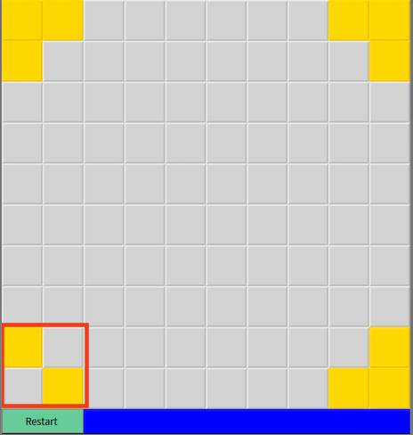
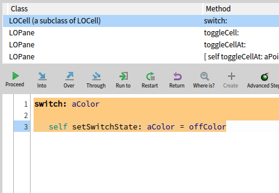

# A method to track the root cause of the Light Outs bug, using object-centric breakpoints

The description of the Lights Out bug can be found here: [../Description/LightsOut.md](../Description/LightsOut.md)

## Bug characteristics

The bug has the following characteristics:
- It is a constructed and injected bug into a real application (a game built in Pharo tutorials),
- it is consistent with bugs that happened in the past in the Pharo code base (typically debugging code left in the committed code),
- although not the same scenario, it conforms to Ressia'12 example `Individual Object Interaction` where an object has an incorrect behavior (here, not changing color) which we want to track.

## The proposed method and possible bias

The proposed method might not be unique, and other methods of investigation might be possible.
However, the proposed method is a direct and simple way to find the bug.
This shows that the bug should be a candidate for which object-centric breakpoints might help in tracking the bug root cause.

In the proposed method, object-centric breakpoints help to understand contextual information about the object that leads to the root cause of the bug.

## Debugging method using object-centric debugging

### Observing the bug

The bug can be observed when trying to switch the colors of one of the corners.
One of the corners does not switch to yellow, which it should: 

### Investigating with standard tools

We can inspect the corner object by right-clicking in the bottom-left corner (the gray one that did not switch to yellow).
Since the observed behavior is a problem with the color not changing, we search for the method supposed to change the color.
We find the method `switch: aColor`.

### Investigating with the object-centric debugger

We put an object-centric breakpoint `halt on call` on that method of the inspected corner object.
When we click on the corner again, the adjacent cells change colors from yellow to gray and the corner object halts:

We observe that the test `color = offColor` always returns true.
We perform the same debugging operations on another cell that correctly change colors, and observe that in that case `color = offColor` does not always returns true.

Looking at the source code in the debugger, we observe that the color should change depending on the state of two variables: `offColor` and `onColor`. 
In the case of the corner object failing to switch color, the on and off colors are the same, which explains the behavior.
Looking at the code in the class of the corner object, we cannot identify any place where these colors are modified.

### Tracking the root cause with standard tools

With the obtained information, the root cause can be tracked down using different methods, among which, for example:
- Looking at the variable references of `offColor` and `onColor`. 
  There is no references in the orner class itself, but looking at its super class we find a method that set both colors to the same value: `onColor := offColor`
- Setting a conditional breakpoint in the method where cells are created with the condition `onColor = offColor`. 
  The debugger stops (see below) and we can track dynamically the method setting both colors to the same value using standard stepping in the initialization code of the cell.

In both cases we arrive at the following code that is the root cause (here from a debugger):

Removing this method solves the problem.

## About the proposed solution to the bug

The proposed method might not be unique, and other methods of investigation might be possible.
However, the proposed method is a direct and simple way to find the bug.
This shows that the bug should be a candidate for which object-centric breakpoints might help in tracking the bug root cause.
In the proposed method, object-centric breakpoints help to understand contextual information about the object that leads to the root cause of the bug.