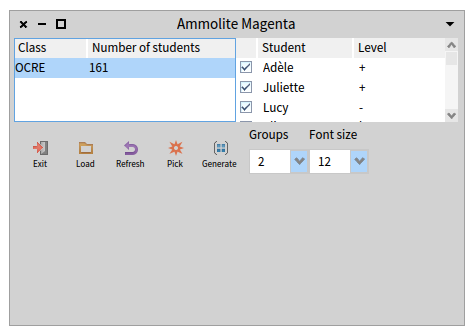
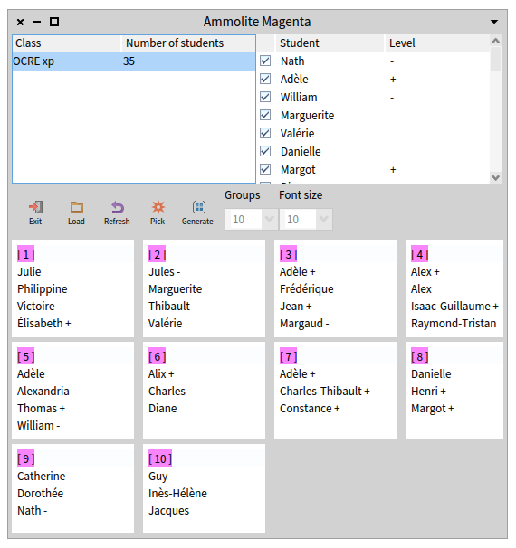
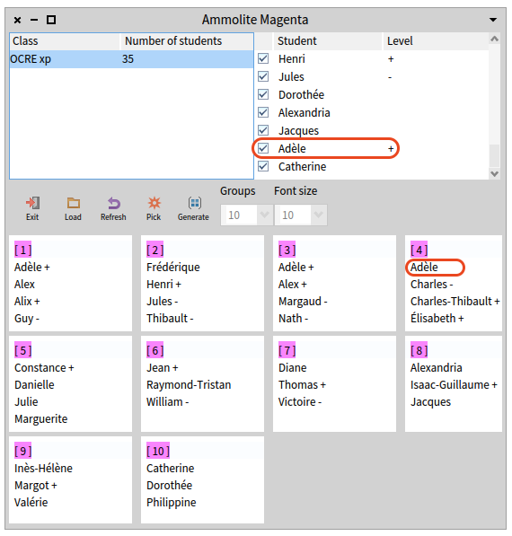

# Ammolite

## The application

Ammolite Magenta is a graphical application that can be launched via `AmmoliteMagenta class >> #run` (click on it).

* Run the application by executing this method (clic on the play button near the method name).

You should see the following application:

Its purpose is to create from a class/promotion, well balanced groups of students depending on their levels.

To represent the level, each student has a marker depending on how they perform during exams compared to average :
- "+" when the level is above
- "-" when the level is lower
- nil otherwise.

To create groups, the user has to select a class/promotion and click onto the "generate" button.
The app the shows the result:

## The Problem

There is three student named Adèle with a "+" marker. However, for one of them, the marker is not printed in group lists.

Only the last Adèle in the list of students produces such behavior.

## Your task

1. Understand why the level marker of this student is not printed in group lists.
2. Fix the bug. Identify the method reponsible for this behavior and fix the correct instruction.

To help you, you can inspect any student in the list by performing a right-click on it. This action will open an inspector on that student.