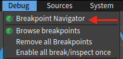

# Tutorial

This tutorial contains 2 guided exercises.
Estimated time: 10 minutes.
Difficulty: easy.

A 3 minutes introduction video is available here: [Introduction video](./Assets/Tutorial/ocb-ins.mov)  
First, watch the video then start the tutorial.

## Context: the OCDBox objects loop
In this example, we will use a class named `OCDBox`. It models a box that holds objects. It has two instance variables, `elements` and `name`, and a few methods in its API. In particular, the method `OCDBox>>#addElement:` (click on it) adds an object into a box.

We will use a test to practice object-centric breakpoints. In this test, we instantiate 100 boxes. We iterate over all these boxes to:

* Add an object to each box,
* print the box on the Transcript.

Open the transcript (Browse > Transcript) then execute this test: `OCDBoxTest>>#testMultipleBoxes`.
The transcript shows you each box that is printed in the iteration loop. 
If you look at the code of the OCDBox class, you will see that:

* Adding an element (`OCDBox>>#addElement:`)  to a box modifies its name,
* the printing method (`OCDBox>>#printString`) uses the name of a box to display that box in the Transcript.

## Tutorial: Breaking when an object receives a message (`haltOnCall`) 

### Scenario

The typical scenario for `haltOnCall` is when you have many instances of the same class running in your program, and you want to debug a specific method for one specific instance. You are interested to answer the following question: _When is this particular object executing this particular method?_ 

### Exercise 1

If you have trouble performing this exercise, you can find it realized in a 3 minutes video there: [Halt on call video](./Assets/Tutorial/hac-vid.mov)

The `OCDBoxTest>>#testMultipleBoxes` test iterates over 100 box objects, and to each box it sends the  `#addElement:` message. In this exercise, we select one box among all the iterated boxes, and we install a `haltOnCall` breakpoint on the `OCDBox>>#addElement:` method of that box. Then, we proceed the test and the  `#addElement:` message is sent to each of the boxes. The execution breaks only when the selected box executes the `OCDBox>>#addElement:` method.

**Step 1: get to the box to debug**
Let us say that we want to debug the tenth box in the box collection.
The first step of object-centric debugging is to obtain this box.

To do that, we first have to interrupt our execution and find the object in the debugger:
* Go to `OCDBoxTest>>#testMultipleBoxes` (click on it)
* Add a `self halt.` instruction just after the first `100 timesRepeat` loop
* Execute the test: the debugger opens on your halt
* Select the `Boxes` variable into the bottom inspector
* Select the 10th box: you got the object to debug!

**Step 2: install a `haltOnCall` breakpoint on our box**
In the object inspector, go to the meta inspection pane and find the method  `OCDBox>>#addElement:`.
* Right-click on that method, and select _halt on call_ in the menu,
* proceed the execution in the debugger.

The test continues and  iterates over the hundred boxes, and sends the addElement: message to each box object. Only the box number 10 that you instrumented breaks when executing this method!

## Tutorial: Breaking when the state of a specific object is touched

### Scenario

The typical scenario for this breakpoint is when you have many instances of the same class running in your program, while you are interested to know when the state of one specific object is modified. You are interested to answer the following question: _When and how is the state of this particular object modified?_

### Exercise 2

If you have trouble performing this exercise, you can find it realized in a 3 minutes video there: [Halt on write video](./Assets/Tutorial/haw-vid.mov)

In this exercise, we reuse our test iterating over a hundred box objects. We select again a box among all the iterated boxes, but this time we want to stop when the `name` instance variable of that box is written to. To that end, we install an object-centric breakpoint on all write accesses to that variable in the selected object. Then, we proceed the test and the execution only breaks when the name instance variable of the selected box is modified.

**Step 1: get to the box to debug**
Perform again the instructions from **Step 1** of **Exercise 1**.

**Step 2: install the breakpoint on the `name` variable**
In the raw pane of the inspector opened on your box object:
* Select the `name` instance variable in the table,
* right-click on that  item, and select `halt on write` in the menu,
* proceed the execution in the debugger.

The test continues and iterates over the hundred boxes.The execution breaks only when the box object we instrumented writes into its `name` instance variable. All other objects are not affected by the breakpoint.

## Removing and disabling breakpoints 
Breakpoints can be removed or disabled.

**From the breakpoint navigator**
The breakpoint navigator gives us views and control over breakpoints installed in the system, such as visualizing where breakpoints are located in the source code and disabling/enabling them dynamically.

The navigator is accessible through Pharo main menu:

In this navigator (see screenshot below), you see the following elements: 
1. The list of installed breakpoints in the system, 
2. the list of methods affected by the selected breakpoint,
3. the source code of the selected affected method, with the breakpoint locations highlighted.

To enable or disable a breakpoint, just tick and untick the checkbox of the breakpoint.
Disabling a breakpoint does not uninstall it, but it stops having any effect.
Disabling and enabling breakpoints can be done dynamically at any point when your program is running.

To remove a breakpoint, just right click on the breakpoint line and select _remove_.

When you select a breakpoint, you see the list of methods affected by that breakpoint.
When you select one of these methods, you see the source code of that method with, highlighted, all the locations in the source code where or when the breakpoint will interrupt the execution.

**From the inspector**
Removing a breakpoint from the inspector is straightforward. Just inspect the object on which you installed a breakpoint.  Go into the breakpoint pane: you can control breakpoints from there in the same manner as in the breakpoint navigator.