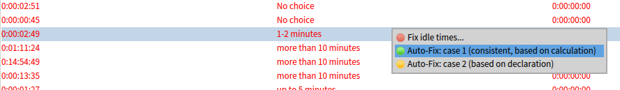
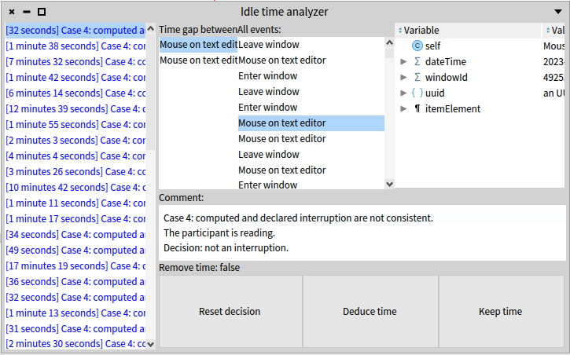
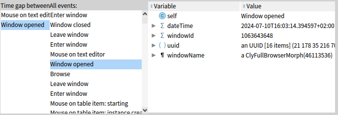
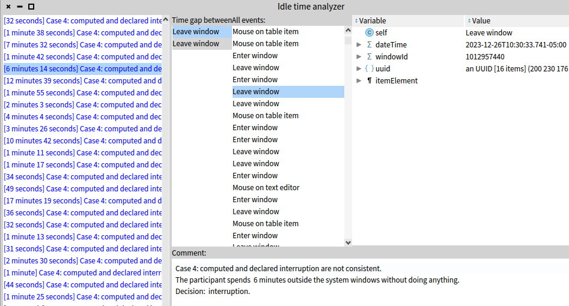

# Experiment data, time computation adjustment

## Procedure

We collect 3 information to recover the time `totalTime` spent on a task:
* The `duration` time: the total time spent from clicking on `start` to clicking on `finish`. This value is calculated from the logs. It excludes the time taken to answer post-task surveys. **Should it include the time taken to answer to the task?** 
* The `interruption` time: the sum of all periods longer than __30 seconds__ during which no logs were generated. This value is calculated from the logs.
* The `declaredInterruption` time: an approximate interruption duration given by participants in each post-task survey. The possible values are:
	* Not interrupted *(we consider there was no interruption)* `declaredInterruption = 0`
	* 1-2 minutes *(we consider 1min30 of interruption)* `declaredInterruption = 1m30`
	* up to 5 minutes *(we consider 5 minutes of interruption)* `declaredInterruption = 5min`
	* up to 10 minutes *(we consider 10 minutes of interruption) `declaredInterruption = 10min`*
	* more than 10 minutes *(we consider 10 minutes of interruption)* `declaredInterruption = 10min`
  
To compute the time spent for a participant, we apply the following manual procedure.

**Case 1 (145 detected)**
`interruption` and `declaredInterruption` are consistent, we consider that the computed interruption time as reference:
```Smalltalk
totalTime := duration - interruption
```

Examples:
- `interruption` = 4 minutes and `declaredInterruption` = "up to 5 minutes". We count 4 minutes of interruption.
- `interruption` = 3 minutes and `declaredInterruption` = "1-2 minutes". We count 3 minutes of interruption.


**Case 2 (7 detected)**
`interruption` is 0 (*i.e.*, no period longer than 30 seconds found in logs), and the participant declared they were interrupted. We take the lower bound of the declared interruption time in their answer: 
```Smalltalk
totalTime := duration - interruption
```
Examples:
- `interruption` = 0 and `declaredInterruption` = "up to 5 minutes". We count 5 minutes of interruption.
- `interruption` = 0 and `declaredInterruption` = "1-2 minutes". We count 1 minute of interruption.
- `interruption` = 0 and `declaredInterruption` = "up to 10 minutes" or "more than 10 minutes". We count 10 minutes of interruption.

This can happen if participants were interrupted or their concentration diverted for multiple periods shorter than 30 seconds. We therefore consider the answer of the participant as reference. For 10 minutes and more, we can only reasonably consider a total of 10 minutes of interruption. We have no means of knowing exactly the interruption time, and such long interruption is unlikely to happen in batches of less than 30 seconds.

**Case 3 (633 detected)**
`interruption` is 0 and `declaredInterruption` was `none` in the survey or was not answered (*e.g.*, it was just not answered by the participant). We count no interruption as none was detected.

**Case 4 (36 detected)**
`interruption` and `declaredInterruption` are not consistent:
* The participant declared no interruption but the system detects interruption times in the logs. 
* The declared time is not consistent with the effective duration of the task (*e.g.*, the declared interruption time is higher than the task execution time and it would put the task execution time below 0)
* The participant declared an interruption time, but the system detected a different interruption time and both times are considerably different.

Examples:
- `interruption` = 2 minutes and `declaredInterruption` = "Not interrupted".
- The total execution time of the task is measured to 7 minutes but the participant declared more than 10 minutes of interruption, which if deduced would produce a negative task execution time.
- `interruption` = 2 minutes and `declaredInterruption` = "up to 10 minutes" or "more than 10 minutes".
- `interruption` = 24 hours and `declaredInterruption` = "up to 10 minutes" or "more than 10 minutes".

For each case, we manually look at the logs and determine if the detected interruption can safely be assumed to be an interruption.
For each case, we justify our decision in a comment that is saved as metadata associated with the participant's data.
We decide that a detected interruption is really an interruption only if we have strong evidence that this is really an interruption time.
For example, if the participant mentionned in their answer that they had a precise interruption, or if the interruption clearly appear in the logs (*e.g.*, a 24 hours gap is clearly an interruption).

**Case 5 (145 detected)**
The detected `interruption` time is lower than the `declaredInterruption`, for example

Examples:
- `interruption` = 2 minutes and `declaredInterruption` = "Up to 5 minutes".
- `interruption` = 6 minutes and `declaredInterruption` = "up to 10 minutes" or "more than 10 minutes".
It is possible participant declared a safe interruption time because they lost track of it or because they estimate that time wrongly.
In any cases, we cannot decide anything on a declared time that is not detected by the system.
Therefore we treat these cases as **case 1** occurences, *i.e.*, we deduce the detected `interruption` time.

**Case 6 (7 detected)**
Implementation numbering error. All cases 6 are cases 2, but may be labelled as `case 6` in the data.

## Procedure setup

To perform the procedure failing in the aforementioned cases, all tasks of all participations corresponding to one of these cases are presented in a GUI list:



The data is presented for each of these tasks with only the detected interruption duration, the declared interruption duration and the total amount of retained duration.
We do not know if the task under observation is a control or a treatment task, nor for which participant.
For each line in the list, we can either automatically fix the time if it fails into one of the obvious cases.
When it does not (*e.g.*, case 4), the `Fix idle times...` action opens a new GUI that presents the logs where the gap was detected.



For tasks failing in **case 4**, we look at these logs to try to understand if the detected time is really an interruption and write down in a comment field the evidence supporting this claim.
In that case, we might observe logs indicating that we are observing the data of a treatment task (*e.g.*, object-centric breakpoint logs). 
In the following screenshot, in the first columns we see the two events between which the time gap was detected.
When we select one of these events, it is automatically selected in the second column in the flow of events of the task, and the third colum shows the details of that event.



For transparency, we report that information in the comment.
An example of case 4 time deduction:



 
## Threats to validity

It is possible that participants have a biased appreciation of their interruption time (*e.g.*, they have a wrong impression that they were interrupted a lot), or that they declare shorter or larger interruption times for many reasons (*e.g.*, they are not totally sure or they do not remember because the task took all their concentration).

It is also possible that a detected a time gap was in fact the participant taking notes however.
If we have a doubt and cannot strongly backup the claim that the detected time gap was an interruption, we do not count that time gap as an interruption.

## Examples

Case 4: computed and declared interruption are not consistent.
The participant spends about 38 seconds outside the system windows without doing anything.
However just after the participant moves their mouse over a text editor and starts navigating. 
It is possible that the participant was reading that text editor.
Decision:  not an  interruption.

Case 4: computed and declared interruption are not consistent.
The participant moves their mouse oveer items in a list, with an interruption of 35 seconds.
This case cannot be decided with any strong argument.
Decision: not an interruption.

Case 4: computed and declared interruption are not consistent.
The participant is reading.
Decision: not an interruption.

Case 4: computed and declared interruption are not consistent.
The participant spends about 3 minutes outside the system windows without doing anything.
Decision:  interruption.


Each time there is an immediate (by checking time) text editor, a read event, or that such event follows the event gap, we consider that the participant is reading.

In some cases we can't detect the declared time by the participant and we can't make a decision to deduce time while analyzing the detection. In that case we trust the participant and we force the retained idle time as a case 2 ==> redo a complete pass over these cases